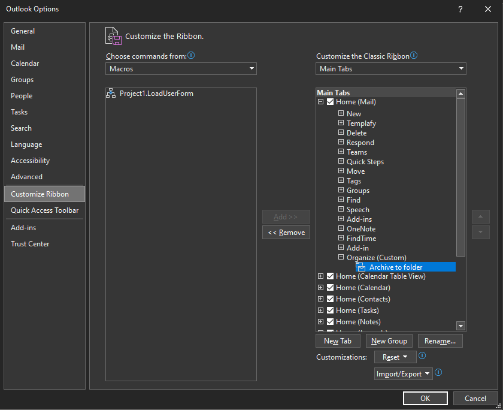

# outlook-move-to-thread
Microsoft Outlook VBA to move emails to the same folder as the rest of the email thread

When this macro is run within the main window of Microsoft Outlook, the user will be prompted with a pop-up containing a list of folders that emails within the thread already reside in, excluding default folders such as "Inbox" and "Sent Items". The user picks a folder from the list and emails will be moved to the selected folder.

If there would only be one folder in the list, then the emails will be moved without prompting the user and the macro displays a message box confirming the move.

## Installation
Open Outlook VBA window using a method such as Alt+F11.

Import files by selecting "File" then "Import File...". Import `ListThread.bas` and `ListThreadFolders.frm`. `ListThreadFolders.frx` must be in the same directory as `ListThreadFolders.frm` when it is imported.

### Signing the Macro

If you receive a warning saying, "The macros in this project are disabled," you probably have security settings that only allow signed macros. 

To do this, follow the [Digitally sign your macro project](https://support.microsoft.com/en-us/office/digitally-sign-your-macro-project-956e9cc8-bbf6-4365-8bfa-98505ecd1c01) article from Microsoft.

After signing and saving the project, you will have to restart Outlook. You may get a warning because the certificate is self-signed (depending on your security settings). If you trust the Publisher (yourself), the notice will not appear again.

## Usage
Run `LoadUserForm` in `ListThread.bas` to start the macro. 

### User-friendly usage

Create a ribbon shortcut button to this subroutine:

1. In Outlook, go to "File" -> "Options" -> "Customize Ribbon".

2. Pick "Macros" in "Choose commands from:"" and select "Project1.LoadUserForm".

3. Decide where to add it and rename it (optional)

For example, creating a "New Group" in "Home (mail)," called ``Organize``. I also did "Rename..."" to ``Archive to folder`` and picked a new icon.

The ribbon will look like this:

Note: If the button stops working the following day or after a restart, macros are probably disabled. Open Outlook VBA (Alt+F11) and run from there (F5). If you get the error stated in [Signing the Macro](#signing-the-macro), follow the steps to sign the code digitally.

## Limitations
The macro crashes if certain symbols such as the percent sign (%) or backslash (\\) are within a folder name.

## Contributing
Pull requests, issues, and feature suggestions are welcome. All code in pull requests must be tested in Outlook and exported directly from the program to ensure import compatibility.

## Acknowledgements
Much of the code has been copied and edited from various sites and forums. Credit to original sources is given in the code where applicable.
